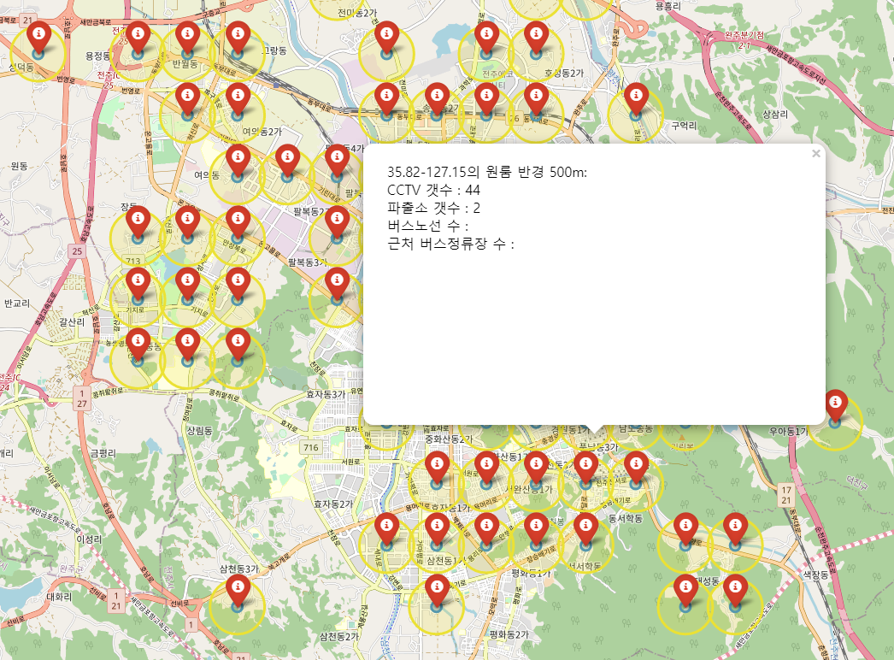
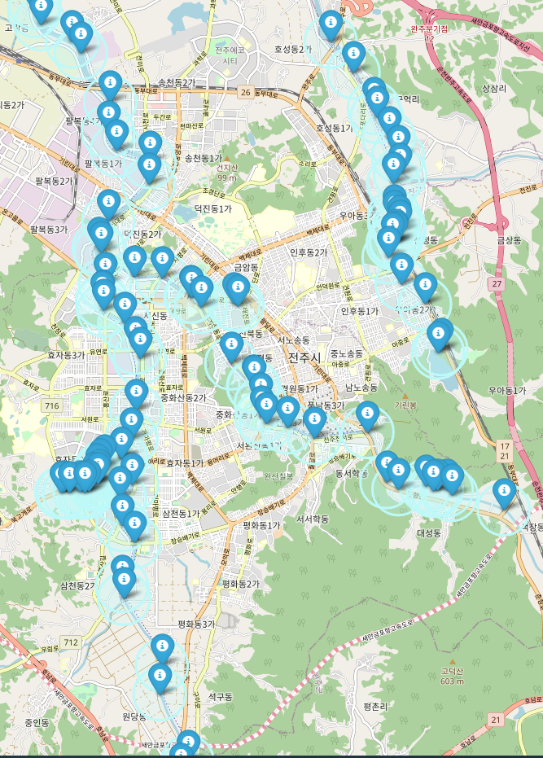
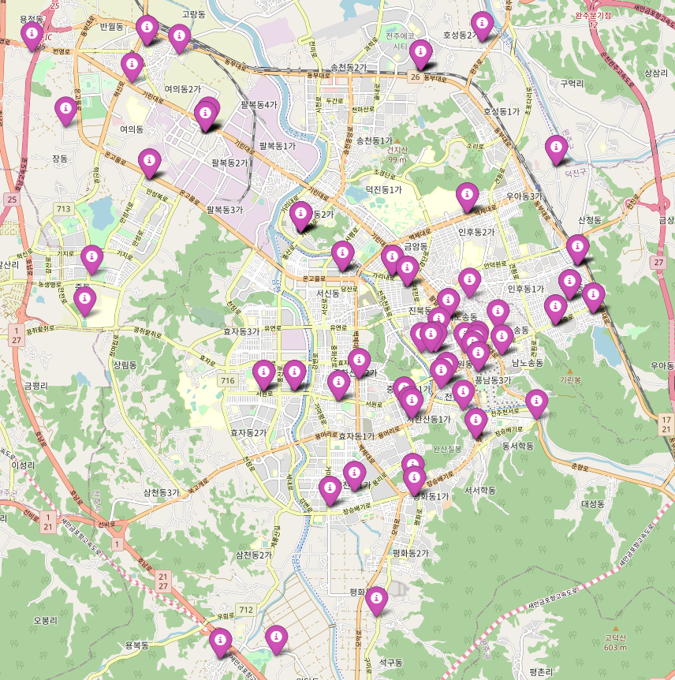
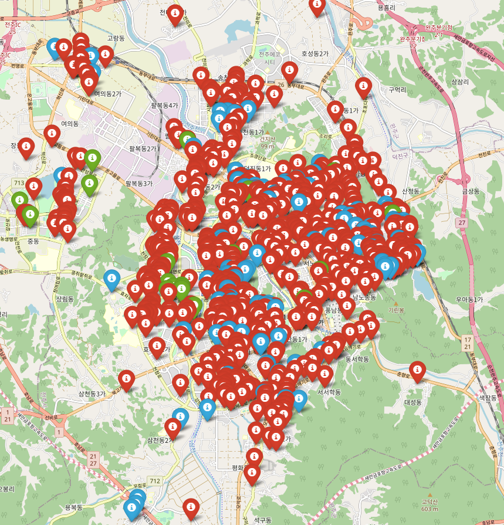

# 어느 지역이 가장 사회초년생이 살기 좋은 곳인가?

## 사회초년생의 특징

- 소득이 부족하다. 월세 / 교통비 / 식비 등을 최대한 절약하고 싶다.
    - 정부 지원금 같은 게 있으면 최대한으로 활용하고 싶다.
- 문화 - 상업시설-자연시설(공원, 강)과 가까운 곳에 살고 싶다.
- 치안이 안정화되면 좋겠다.
- 계약기간이 만료되면 다른 곳으로 이사를 가야 한다.
- 유동인구가 너무 많은 곳은 시끄러워서 싫다.
- 벌레가 안 나오면 좋겠다.

## 분석 데이터의 종류

### 건물에 대해

- 소득과 지원금 등에 관련된 데이터
    - 원룸의 보증금과 월세
    - LH 지원금의 종류와 원룸의 적용가능도
- 대중교통(주로 버스)의 활성화 정도
    -  - 집 근처 200m 안의 정류장에 버스 노선이 몇 개나 오가는가?
- 카페-상업시설(편의점&슈퍼&대형마트)-영화관-자연시설(공원&강)과 가까운 곳에서 살고 싶다.
    - 카페 위치를 기반으로 반경 m안에 몇 개의 카페가 있는지 확인
    - 상업시설 위치를 기반으로 반경 m안에 몇 개의 상업시설이 있는지 확인
    - 영화관 위치를 기반으로 반경 m안에 몇 개의 영화관이 있는지 확인
- 치안이 안정화된 곳이면 좋다.
    - 근처 CCTV와 파출소의 위치를 기반으로 반경 m안에 몇 개의 CCTV+파출소가 있는지 확인
- 근처 매물이 많은 곳이면 좋겠다.
    - 근처 원룸의 밀집도를 계산하여 50채 / 100채 / 150채 이상의 경우 가산점을 부여한다.
- 유동인구가 너무 많은 곳은 시끄럽다.
    - 유동인구를 분석하여 유동인구가 많을 수록 감점 요인을 부여한다.
- 벌레가 안 나오면 좋겠다.
    - 신식 건물은 비교적 벌레 출현율이 낮을 것이므로, 건물의 건축연도를 확인하여 신축 / 준신축 / 구건물로 구분하여 신축일수록 높은 점수를 준다.
- 주차 공간
    - 원룸에 주차 공간이 있었으면 좋겠다.

### 사람에 대해

- 3 종류의 가상의 캐릭터를 생성한다.
    - 인원 A : 자본금 Low / 차량 X / 문화-여가생활 선호도 High / 여성 / 쇼핑 잦음 / 벌레 무서워함
    - 인원 B : 자본금 Middle / 차량 O / 문화-여가생활 선호도 Middle / 여성 / 쇼핑 보통 / 벌레 무서워함
    - 인원 C : 자본금 Middle / 차량 O / 문화 여가생활 선호도 Low / 남성 / 쇼핑 낮음 /벌레 무서워하지 않음

## 평가 방법

- 위 데이터들을 종합하여 총점을 환산하고, 각 인원에 적합한 결과값을 시각화해서 보여준다.

## 사용 도구

- 분석 : Python
- 시각화 : Folium

## 자료 출처

- 읍면동, 시군구, 시도 Geojson : http://www.gisdeveloper.co.kr/?p=2332
- 시내버스 정보, 원룸 및 오피스텔 현황, 대규모점포현황 : 전주데이터포털

# 데이터 전처리

## 거주지 데이터

- 다음과 같은 형태로 구성된 [전주시내 원룸 및 오피스텔 현황](https://www.data.go.kr/data/15077153/fileData.do)을 다운받음
    - 형태
        - 건축연도가 '알수없음' 인 행은 모두 제거함
        - 
    - 
    - 주요통계량
    - 

```python
p = re.compile(r'\d+')
room_data['건축연도'] = room_data['건축연도'].map(lambda x: x if p.search(x) else '0')
room_data.drop(room_data[room_data['건축연도'].map(lambda x:int(x[:4])) < 1945].index, inplace=True) #해방 전 옛 건물들 제거
room_data.drop(room_data[room_data['세대수(객실수)']<1].index, inplace=True) #세대수가 0인 것 제거
room_data['const_year_point'] = 5-(dt.datetime.today().year-room_data['건축연도'].map(lambda x: int(x[:4])))//5

room_data.describe()
```

- 건물위치가 지번 주소로 되어 있어, folium 지도상에 표현하기 어려우므로 지번 주소를 좌표로 바꾸는 작업을 vworld API를 활용하여 진행

```python
response = requests.get(f"http://api.vworld.kr/req/address?service=address&request=getCoord&key={key}&address={location}&type=PARCEL")
    if 'result' in response.json()['response']:
        x= float(response.json()['response']['result']['point']['x'])
        y = float(response.json()['response']['result']['point']['y'])
        arr.append([float(x),float(y)])
```

- 변환한 좌표를 소수점 세째자리에서 반올림하여, 아주 인접한 원룸의 경우 하나의 그룹으로 묶어 구성함

```python
f = open('./loc.txt', 'r')
lines = f.readlines()
map1 = folium.Map(location=[35.83001,127.125001], zoom_start=13)
arr = []
for line in lines:
    lat,long = map(float, line.split(','))
    lat = round(lat,2)
    long = round(long,2)
    if [lat,long] not in arr:
        arr.append([lat,long])

for content in arr:
    lat,long = content
    folium.Marker([long, lat], popup=f'{long}-{lat}의 원룸', icon=folium.Icon(color='red',icon='info-sign')).add_to(map1)
    folium.Circle([long, lat], radius=100, color='#3186cc', fill_color='#3186cc', popup=f'{long}-{lat}의 원룸 반경 100M').add_to(map1)
    folium.Circle([long, lat], radius=500, color='#ebe134', fill_color='#ebe134', popup=f'{long}-{lat}의 원룸 반경 500m').add_to(map1)
map1.save('map1.html')
```

- 만들어진 지도의 유형(파란 원 : 반경 100m, 노란 원 : 반경 500m)


## 버스 정류장 및 버스 노선 데이터

- 전주시 공공 API를 활용하여, 전주시에서 운영하는 모든 노선의 버스 정류장의 좌표를 받음
- 해당 좌표 중, 김제시/완주군 부분은 이번 분석에서 다루지 않을 예정이므로, 전주시 인근의 좌표에 해당하지 않는 정류장은 표시하지 않음
    - 전주시의 주요 좌표는 [링크](http://www.jeonju.go.kr/index.9is?contentUid=9be517a74f8dee91014f92106ff010c3&subPath=) 에서 확인함
    - 위 데이터를 토대로 표기한 전주시내의 정류장 데이터는 아래와 같음(빨간 마커 : 원룸 구역 / 녹색 마커 : 버스정류장)
        - 
        - 본 연구에서, 한 개인이 일상적으로 이용할 수 있는 버스정류장까지의 직선거리는 500m 내외로 규정함.
            - 각 원룸 구역을 기준으로, 반경 500m에 있는 정류장들의 위치를 near_bus_stop으로 정하고 해당 정류장을 오가는 노선 ID의 갯수를 토대로 각 원룸의 전주시내 대중교통 편의성을 측정함.
            
            - ```python
              bus_dict = {}
              
              bus_x = list(bus_data['0'])
              bus_y = list(bus_data['1'])
              bus_near = bus_data['near_bus_stop']
              total_bus = list(bus_data['total_bus'])
              total_bus_stop = list(bus_data['near_bus_stop_count'])
              conv_dict.setdefault(f'{content[0]}-{content[1]}', 0)
              print(total_bus)
              for i in range(len(bus_x)):
                  num = total_bus[i]
                  if np.isnan(total_bus[i]):
                      num=0.0
                  bus_dict.setdefault(f'{bus_x[i]}-{bus_y[i]}',  [num, total_bus_stop[i]])
              ```
            
              

## 치안 데이터

- cctv
    - 데이터 출처 : [링크](https://www.data.go.kr/tcs/dss/selectApiDataDetailView.do?publicDataPk=3069061)
    
    - xml 형태 데이터를 파싱해서 가공. 전체 데이터 약 1400개
    
    - 좌표 형태의 데이터를 기준으로, 거주지로부터 반경 500m 이내에 몇 개의 cctv가 있는지를 계산
    
    - ```python
      for cctv in cctv_arr:
          if ((content_lat-cctv[0])**2+(content_long-cctv[1])**2)**(1/2) <= ((content_lat-(content_lat-0.0055))**2+(content_long-(content_long-0.0055))**2)**(1/2):
              cctv_dict[f'{lat}-{long}']+=1
      ```
    
      
    
    - 계산된 값을 거주지 마커 팝업에 표기
- 파출소
    - 데이터 출처 
        - 전주완산경찰서 : https://jjws.jbpolice.go.kr/index.police?menuCd=DOM_000000305006000000
        
        - 전주덕진경찰서 : https://jjdj.jbpolice.go.kr/index.police?menuCd=DOM_000000805006000000
        
        - 파일/API 데이터가 없어서, 일일이 경찰서 / 파출소 / 지구대 도로명주소를 텍스트로 수집
        
        - 수집된 데이터를 vworld API를 활용하여 좌표로 변형
        
        - ```python
          police_loc = [[127.146461566, 35.834468712], [127.16380635, 35.835774879], [127.120456415, 35.848296399], 
                        [127.132636253, 35.826902578], [127.149387537, 35.863971253], [127.076131218, 35.872743759],
                        [127.107977884, 35.856099777], [127.123538425, 35.858744294], [127.118451299, 35.857844477], 
                        [127.160431827, 35.850066374], [127.062692384, 35.839356441], [127.092696544, 35.84296123], 
                        [127.146036617, 35.823575242], [127.121085454, 35.79975135], [127.126785309, 35.812004112], 
                        [127.111398444, 35.835411819], [127.123993749, 35.806270762], [127.096152619, 35.821300798], 
                        [127.135674461, 35.791003554], [127.151890494, 35.807513991], [127.146370384, 35.815267116]]
          ```
        
          
    - 좌표 형태의 데이터를 기준으로, 거주지로부터 반경 500m 이내에 몇 개의 경찰서가 있는지를 계산
    - 계산된 값을 거주지 마커 팝업에 표기



## 상권 데이터

### 편의점

- 데이터 출처 : [링크](https://data-on.co.kr/search?keyword=%EC%A0%84%EA%B5%AD%20%ED%8E%B8%EC%9D%98%EC%A0%90%20%EC%A3%BC%EC%86%8C%20%EC%A2%8C%ED%91%9C&id=1268)

- ```python
  conv_df = pd.read_csv('conv_store.csv', encoding='cp949')
  conv_df['위도'].dropna()
  conv_jeonju = conv_df[conv_df['주소'].str.contains('전북 전주')] ## 전체 문서 중 전주 편의점만 확보
  ```

  

- 원룸 좌표를 기준으로 반경 500m 이내 편의점의 좌표가 몇 개나 포함되는지 확인

- 

## 환경 데이터

### 공원

- 전주 지역에 공원이라는 이름을 단 지역의 도로명 / 지번 주소를 확보

- 확보한 데이터를 각각 VWORLD API로 좌표 추출

- 공원명을 key로, 좌표[x, y]를 value로 하는 dict를 생성

- ```python
  park_addr={'전북 전주시 덕진구 고내천변로 58': [127.103045423, 35.875572562],
   '전북 전주시 덕진구 권삼득로 390 전주덕진공원': [127.121031159, 35.847494653],
   '전북 전주시 덕진구 덕진동1가 640-10': [127.140260164919, 35.8531846654219],
   '전북 전주시 덕진구 덕진동2가 646-1': [127.106251503516, 35.8467190779429],
  ....
   '전북 전주시 완산구 효자천변1길 31': [127.114512822, 35.800696164]}
  ```

- 생성된 dict를 바탕으로 각 원룸구역 별 인근 공원이 몇 개나 존재하는지를 확인

### 천변

- 강변의 변곡점을 좌표로 하는 데이터를 구글 지도를 통해 생성
- 생성된 변곡점을 기준으로 강변의 여부를 판단

```python
for content in arr:
    content_lat = content[0]
    content_long = content[1]
    river_count = 0
    i=1
    
    for river in river_list:
        for river_loc in river:
            if ((content_lat-river_loc[1])**2+(content_long-river_loc[0])**2)**(1/2) <= ((content_lat-(content_lat-0.011))**2+(content_long-(content_long-0.011))**2)**(1/2):
                river_count+=1
                break
        i+=1
```


- 강변 예시 이미지



## 부동산 데이터

- 데이터 출처 : 국토교통부 실거래가 공개시스템
- 데이터 내역 : 최근 1년간의
    - 전주시 덕진구의 단독주택 / 연립주택 / 오피스텔의 실거래가
    - 전주시 완산구의 단독주택 / 연립주택 / 오피스텔의 실거래가
    - 
- 분석 절차
    - 지역별 매물의
        - 월세 기준 보증금 / 월세 평균을 출력한다.
        - 전세 기준 보증금 평균을 출력한다.



### 부동산 데이터 구조화

- 각 지역별 평균 계약 월세 / 보증금과 계약 건수 확보

- 각 지역별 좌표 '전북 전주시'+' '+dong+' '+도로명 으로 API 조회한 뒤 좌표 확인해서 데이터셋에 추가



- 주택 포인트별로 해당 좌표에 해당하는 월세/보증금을 합산한 뒤 csv 문서를 생성할 것.

```python
wansan_trade_mono = pd.read_excel(wansan_file_list[0], header=16)
j = wansan_trade_mono
j['보증금(만원)']=j['보증금(만원)'].str.strip()
j['보증금(만원)']=j['보증금(만원)'].str.replace(',','')
j.dropna()
j.drop(j[j['보증금(만원)']=='NaN'].index, inplace=True)
j['보증금(만원)'] = pd.to_numeric(j['보증금(만원)'], errors='coerce')

j['address']=j['시군구']+' '+j['도로명']
j['dong']=j['시군구'].map(lambda x: x.split()[2])
j_count = j.groupby(['전월세구분','dong','도로명']).count()
j_mean = j.groupby(['전월세구분','dong','도로명']).mean()

j_count.to_csv('wansan_mono_count.csv',sep=',',na_rep='NaN', encoding='cp949', index=False)
 j_mean.to_csv('wansan_mono_mean.csv',sep=',',na_rep='NaN', encoding='cp949', index=False)
```


- 생성한 것을 바탕으로 지도에 표시(빨간색 : 단독주택 / 녹색 : 연립주택 / 파란색 : 오피스텔)

## 의료 데이터

- 데이터 출처 : [링크](https://www.data.go.kr/tcs/dss/selectApiDataDetailView.do?publicDataPk=3045535)

- API 데이터를 바탕으로 약국의 좌표 확보

- 현재 구한 포인트들을 기준으로, 약국 좌표가 반경 500m 안에 들어왔는지 파악하고 들어왔다면 count 수를 늘려줌

- ```python
  pharmacy_dict = {}
  
  for content in arr:
      content_lat = content[0]
      content_long = content[1]
      pharmacy_count = 0
      
      for i in range(len(mediname_arr)):
          phar_x = medi_x[i]
          phar_y = medi_y[i]
          if ((content_lat-phar_x)**2+(content_long-phar_y)**2)**(1/2) <= ((content_lat-(content_lat-0.0055))**2+(content_long-(content_long-0.0055))**2)**(1/2):
              pharmacy_count+=1
      pharmacy_dict[f'{content[0]}-{content[1]}']=pharmacy_count
      
  pprint.pprint(pharmacy_dict)
  ```

## 설문 데이터

- 위의 데이터와는 달리, 설문 데이터는 지리 데이터들에 대한 가중치를 어떻게 줄지를 결정하는 데 목적이 있음

- 그러므로 지리 데이터와 관련된 질문이 있어야 함.

- ```python
  weight_1 = int(input('근처의 원룸이 많은 게 좋나요? 싫을수록 1점, 좋을수록 5점을 주세요.'))
  weight_2 = int(input('산책이 삶에 있어 중요한가요? 중요하지 않을수록 1점, 중요할수록 5점을 주세요.'))
  weight_3 = int(input('어두운 곳을 다닐 때 두려움을 느끼나요? 무신경할수록 1점, 예민할수록 5점을 주세요.'))
  weight_4 = int(input('편의점을 자주 이용하시나요?? 아닐수록 1점, 그럴수록 5점을 주세요.'))
  weight_5 = int(input('자차가 있으신가요? 있으시면 1점, 없으시면 5점을 주세요.'))
  weight_6 = int(input('잔병치레가 잦은 편이신가요? 아니실수록 1점, 맞을수록 5점을 주세요.'))
  weight_7 = int(input('집을 구할 때 경제적인 요소가 중요하신가요? 아니실수록 1점, 깊게 공감할수록 5점을 주세요.'))
  ```

- 받은 데이터들을 0.5 ~ 1.5 사이의 값으로 재정의

```python
for i in [weight_1, weight_2, weight_3, weight_4, weight_5, weight_6, weight_7]:
    if i<2:
        i=0.5
    elif i==2:
        i=0.75
    elif i==3:
        i=1
    elif i==4:
        i=1.25
    else:
        i=1.5
```

# 데이터 표준화

우리가 분석할 수 있는 데이터는

- 인근 주택 수
- 인근 공원 / 강의 수
- 인근 CCTV / 파출소 수
- 인근 편의점 수
- 인근 버스정류장 및 경유 버스 노선 수
- 인근 약국 수
- 해당 지역의 최근 1년간 거래성사된
  - 단독주택(전/월세)의 평균 보증금, 월세 및 계약건수
  - 연립주택(전/월세)의 평균 보증금, 월세 및 계약건수
  - 오피스텔(전/월세)의 평균 보증금, 월세 및 계약건수

가 있다. 이들 중 보증금은 대개 단위가 1000만원 이상인 데 반해 강의 수는 아무리 많은 지역도 3개를 넘지 못한다. 따라서 이들의 점수를 측정하려 할 때 편차치가 발생할 수 있다. 따라서 정규화를 통해 해당 값들을 일정 범위 내의 값으로 재정의할 필요가 있다.

```python
total_df_normal['result_normalize'] = (total_df_normal['result'] - min(total_df_normal['result']))/(max(total_df_normal['result'])-min(total_df_normal['result']))
```

# 데이터 표시

- 지금껏 정리한 데이터들의 raw값과, 표준화된 값을 가져온다.
- raw값들은 포인트들의 iframe에 삽입되는 해당 지역의 실제 지표값에 사용된다.


- raw값과 설문데이터에서의 유저 선호도를 종합하여 아래의 수식에 의거해서 값을 계산한다.

  
  - C : 유저가 정의한 가중치 , V : 정규화를 통해 추출한 값

- 이렇게 정규화한 값에 100을 곱해주어, 최종 평점을 0~100 사이에 위치하게 함.


## 평점의 시각화

- 모든 포인트들에 대한 평점 계산을 마친 뒤, 순위를 계산함
- 가장 평점이 높은 경우 초록색 마커로 표시
- 2~3위인 경우 오렌지색 마커로 표시
- 4~5위인 경우 분홍색 마커로 표시
- 6~10위인 경우 짙은 청색 마커로 표시


## 결과 해석

- 결과 측정을 위해 세 명의 서로 다른 가상의 인물과 특징을 설정한 뒤, 위에서 분석한 데이터를 통해 어느 지역에 거주하는 것이 합리적인지를 표시하고자 함.
- 각 인물들의 설정은 아래의 그림과 같음.

- 각 인물들의 설정에 맞게 유저 선호도를 입력한 뒤, 위의 평점 계산식을 활용하여 시각화함.


