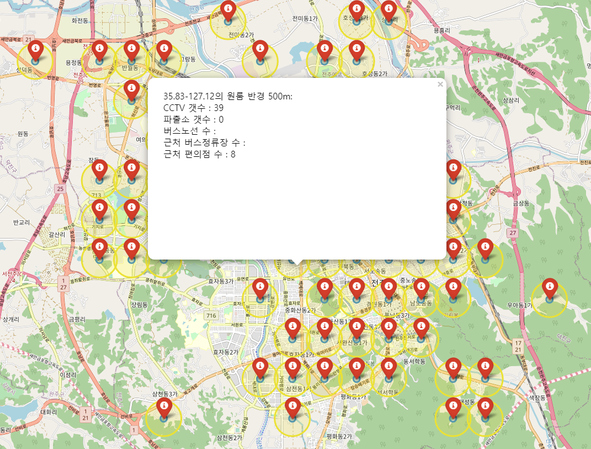

# 어느 지역이 가장 사회초년생이 살기 좋은 곳인가?

## 사회초년생의 특징

- 소득이 부족하다. 월세 / 교통비 / 식비 등을 최대한 절약하고 싶다.
    - 정부 지원금 같은 게 있으면 최대한으로 활용하고 싶다.
- 문화 - 상업시설-자연시설(공원, 강)과 가까운 곳에 살고 싶다.
- 치안이 안정화되면 좋겠다.
- 계약기간이 만료되면 다른 곳으로 이사를 가야 한다.
- 유동인구가 너무 많은 곳은 시끄러워서 싫다.
- 벌레가 안 나오면 좋겠다.

## 분석 데이터의 종류

### 건물에 대해

- 소득과 지원금 등에 관련된 데이터
    - 원룸의 보증금과 월세
    - LH 지원금의 종류와 원룸의 적용가능도
- 대중교통(주로 버스)의 활성화 정도
    -  - 집 근처 200m 안의 정류장에 버스 노선이 몇 개나 오가는가?
- 카페-상업시설(편의점&슈퍼&대형마트)-영화관-자연시설(공원&강)과 가까운 곳에서 살고 싶다.
    - 카페 위치를 기반으로 반경 m안에 몇 개의 카페가 있는지 확인
    - 상업시설 위치를 기반으로 반경 m안에 몇 개의 상업시설이 있는지 확인
    - 영화관 위치를 기반으로 반경 m안에 몇 개의 영화관이 있는지 확인
- 치안이 안정화된 곳이면 좋다.
    - 근처 CCTV와 파출소의 위치를 기반으로 반경 m안에 몇 개의 CCTV+파출소가 있는지 확인
- 근처 매물이 많은 곳이면 좋겠다.
    - 근처 원룸의 밀집도를 계산하여 50채 / 100채 / 150채 이상의 경우 가산점을 부여한다.
- 유동인구가 너무 많은 곳은 시끄럽다.
    - 유동인구를 분석하여 유동인구가 많을 수록 감점 요인을 부여한다.
- 벌레가 안 나오면 좋겠다.
    - 신식 건물은 비교적 벌레 출현율이 낮을 것이므로, 건물의 건축연도를 확인하여 신축 / 준신축 / 구건물로 구분하여 신축일수록 높은 점수를 준다.
- 주차 공간
    - 원룸에 주차 공간이 있었으면 좋겠다.

### 사람에 대해

- 3 종류의 가상의 캐릭터를 생성한다.
    - 인원 A : 자본금 Low / 차량 X / 문화-여가생활 선호도 High / 여성 / 쇼핑 잦음 / 벌레 무서워함
    - 인원 B : 자본금 Middle / 차량 O / 문화-여가생활 선호도 Middle / 여성 / 쇼핑 보통 / 벌레 무서워함
    - 인원 C : 자본금 Middle / 차량 O / 문화 여가생활 선호도 Low / 남성 / 쇼핑 낮음 /벌레 무서워하지 않음

## 평가 방법

- 위 데이터들을 종합하여 총점을 환산하고, 각 인원에 적합한 결과값을 시각화해서 보여준다.

## 사용 도구

- 분석 : Python
- 시각화 : Folium

## 자료 출처

- 읍면동, 시군구, 시도 Geojson : http://www.gisdeveloper.co.kr/?p=2332
- 시내버스 정보, 원룸 및 오피스텔 현황, 대규모점포현황 : 전주데이터포털

# 데이터 전처리

## 거주지 데이터

- 다음과 같은 형태로 구성된 전주시내 원룸 및 오피스텔 현황을 다운받음
    - 형태
        - 건축연도가 '알수없음' 인 행은 모두 제거함
        - 
    - 
    - 주요통계량
    - 

```python
p = re.compile(r'\d+')
room_data['건축연도'] = room_data['건축연도'].map(lambda x: x if p.search(x) else '0')
room_data.drop(room_data[room_data['건축연도'].map(lambda x:int(x[:4])) < 1945].index, inplace=True) #해방 전 옛 건물들 제거
room_data.drop(room_data[room_data['세대수(객실수)']<1].index, inplace=True) #세대수가 0인 것 제거
room_data['const_year_point'] = 5-(dt.datetime.today().year-room_data['건축연도'].map(lambda x: int(x[:4])))//5

room_data.describe()
```

- 건물위치가 지번 주소로 되어 있어, folium 지도상에 표현하기 어려우므로 지번 주소를 좌표로 바꾸는 작업을 vworld API를 활용하여 진행

```python
response = requests.get(f"http://api.vworld.kr/req/address?service=address&request=getCoord&key={key}&address={location}&type=PARCEL")
    if 'result' in response.json()['response']:
        x= float(response.json()['response']['result']['point']['x'])
        y = float(response.json()['response']['result']['point']['y'])
        arr.append([float(x),float(y)])
```

- 변환한 좌표를 소수점 세째자리에서 반올림하여, 아주 인접한 원룸의 경우 하나의 그룹으로 묶어 구성함

```python
f = open('./loc.txt', 'r')
lines = f.readlines()
map1 = folium.Map(location=[35.83001,127.125001], zoom_start=13)
arr = []
for line in lines:
    lat,long = map(float, line.split(','))
    lat = round(lat,2)
    long = round(long,2)
    if [lat,long] not in arr:
        arr.append([lat,long])

for content in arr:
    lat,long = content
    folium.Marker([long, lat], popup=f'{long}-{lat}의 원룸', icon=folium.Icon(color='red',icon='info-sign')).add_to(map1)
    folium.Circle([long, lat], radius=100, color='#3186cc', fill_color='#3186cc', popup=f'{long}-{lat}의 원룸 반경 100M').add_to(map1)
    folium.Circle([long, lat], radius=500, color='#ebe134', fill_color='#ebe134', popup=f'{long}-{lat}의 원룸 반경 500m').add_to(map1)
map1.save('map1.html')
```

- 만들어진 지도의 유형(파란 원 : 반경 100m, 노란 원 : 반경 500m)


## 버스 정류장 및 버스 노선 데이터

- 전주시 공공 API를 활용하여, 전주시에서 운영하는 모든 노선의 버스 정류장의 좌표를 받음
- 해당 좌표 중, 김제시/완주군 부분은 이번 분석에서 다루지 않을 예정이므로, 전주시 인근의 좌표에 해당하지 않는 정류장은 표시하지 않음
    - 전주시의 주요 좌표는 [링크](http://www.jeonju.go.kr/index.9is?contentUid=9be517a74f8dee91014f92106ff010c3&subPath=) 에서 확인함
    - 위 데이터를 토대로 표기한 전주시내의 정류장 데이터는 아래와 같음(빨간 마커 : 원룸 구역 / 녹색 마커 : 버스정류장)
        - 
        - 본 연구에서, 한 개인이 일상적으로 이용할 수 있는 버스정류장까지의 직선거리는 500m 내외로 규정함.
            - 각 원룸 구역을 기준으로, 반경 500m에 있는 정류장들의 위치를 near_bus_stop으로 정하고 해당 정류장을 오가는 노선 ID의 갯수를 토대로 각 원룸의 전주시내 대중교통 편의성을 측정함.

## 치안 데이터

- cctv
    - 데이터 출처 : [링크](https://www.data.go.kr/tcs/dss/selectApiDataDetailView.do?publicDataPk=3069061)
    - xml 형태 데이터를 파싱해서 가공. 전체 데이터 약 1400개
    - 좌표 형태의 데이터를 기준으로, 거주지로부터 반경 500m 이내에 몇 개의 cctv가 있는지를 계산
    - 계산된 값을 거주지 마커 팝업에 표기
- 파출소
    - 데이터 출처 
        - 전주완산경찰서 : https://jjws.jbpolice.go.kr/index.police?menuCd=DOM_000000305006000000
        - 전주덕진경찰서 : https://jjdj.jbpolice.go.kr/index.police?menuCd=DOM_000000805006000000
        - 파일/API 데이터가 없어서, 일일이 경찰서 / 파출소 / 지구대 도로명주소를 텍스트로 수집
        - 수집된 데이터를 vworld API를 활용하여 좌표로 변형
    - 좌표 형태의 데이터를 기준으로, 거주지로부터 반경 500m 이내에 몇 개의 경찰서가 있는지를 계산
    - 계산된 값을 거주지 마커 팝업에 표기


## 상권 데이터

### 편의점

- 데이터 출처 : [링크](https://data-on.co.kr/search?keyword=%EC%A0%84%EA%B5%AD%20%ED%8E%B8%EC%9D%98%EC%A0%90%20%EC%A3%BC%EC%86%8C%20%EC%A2%8C%ED%91%9C&id=1268)
- 원룸 좌표를 기준으로 반경 500m 이내 편의점의 좌표가 몇 개나 포함되는지 확인
- 

## 환경 데이터

### 공원

- 전주 지역에 공원이라는 이름을 단 지역의 도로명 / 지번 주소를 확보
- 확보한 데이터를 각각 VWORLD API로 좌표 추출
- 공원명을 key로, 좌표[x, y]를 value로 하는 dict를 생성
- 생성된 dict를 바탕으로 각 원룸구역 별 인근 공원이 몇 개나 존재하는지를 확인

### 천변

- 강변의 변곡점을 좌표로 하는 데이터를 구글 지도를 통해 생성
- 생성된 변곡점을 기준으로 강변의 여부를 판단
- 강변 예시 이미지


## 부동산 데이터

- 데이터 출처 : 국토교통부 실거래가 공개시스템
- 데이터 내역 : 최근 1년간의
    - 전주시 덕진구의 단독주택 / 연립주택 / 오피스텔의 실거래가
    - 전주시 완산구의 단독주택 / 연립주택 / 오피스텔의 실거래가
- 분석 절차
    - 지역별 매물의
        - 월세 기준 보증금 / 월세 평균을 출력한다.
        - 전세 기준 보증금 평균을 출력한다.
- 분석 결과


- 